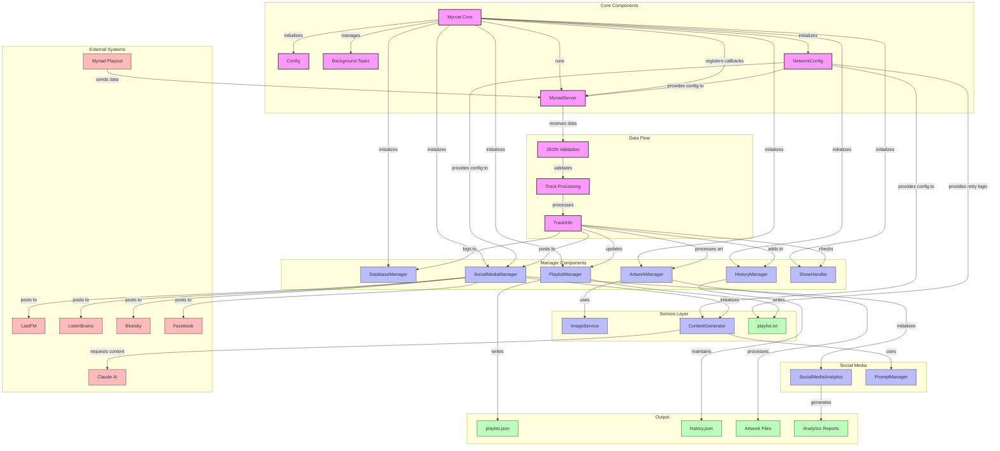
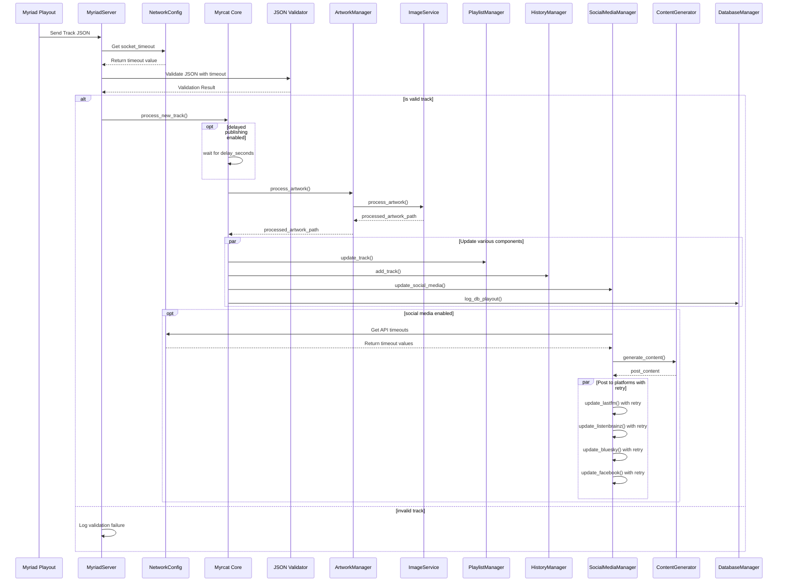
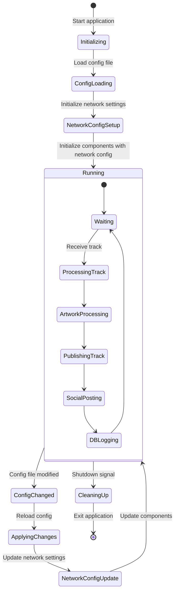

# Myrcat Architecture Documentation

This document provides a comprehensive overview of the Myrcat system architecture, design patterns, data flow, and extension points.

## System Overview

Myrcat (Myriad Cataloger) is a specialized service that processes radio track playouts from the Myriad playout system. It provides track metadata publishing, artwork processing, social media integration, and analytics in a modular, extensible architecture.

## Architecture Diagram



## Directory Structure and Key Components

```
myrcat/
├── __init__.py           # Package definition with version info
├── main.py               # Entry point with argument parsing
├── core.py               # Central application class
├── server.py             # Socket server implementation
├── config.py             # Configuration management
├── models.py             # Data model definitions
├── utils/                # Utility functions
│   ├── __init__.py       # Re-exports utilities for compatibility
│   ├── decode.py         # JSON decoding utilities
│   ├── file.py           # File operation utilities
│   ├── image.py          # Image processing utilities
│   ├── logging.py        # Logging configuration
│   ├── network.py        # Network utilities and retry logic
│   └── strings.py        # String processing utilities
├── services/             # Service layer components
│   ├── __init__.py       # Package definition
│   └── image_service.py  # Centralized image processing service
├── exceptions.py         # Custom exception classes
└── managers/             # Specialized component managers
    ├── artwork.py        # Artwork processing
    ├── database.py       # SQLite database operations
    ├── history.py        # Track history management
    ├── playlist.py       # Playlist file generation
    ├── social_media.py   # Social platform integration
    ├── content.py        # AI content generation
    ├── analytics.py      # Social media analytics
    ├── prompt.py         # AI prompt management
    ├── research.py       # Artist research and image search
    └── show.py           # Radio show management
```

## Core Architecture

Myrcat follows a component-based architecture with clean dependency management and asynchronous execution:

1. **Entry Point**: `myrcat.py` invokes the `main()` function from `myrcat/main.py`
2. **Application Core**: The `Myrcat` class in `core.py` serves as the central coordinator
3. **Service Layer**: Shared functionality extracted to services for reuse across components
4. **Component Managers**: Specialized classes handle specific aspects of functionality
5. **Data Flow**: Socket server → JSON validation → Track processing → Multi-component handling

### Initialization Flow

```python
def main():
    args = parse_arguments()
    app = Myrcat(args.config)  # Load config and initialize components
    asyncio.run(app.run())     # Start async event loop
```

The main `Myrcat` class initializes all components with appropriate dependencies:

```python
def _initialize_components(self):
    # Load configuration settings
    
    # Initialize core components
    self.db = DatabaseManager(self.config.get("general", "database_path"))
    self.playlist = PlaylistManager(self.playlist_json, self.playlist_txt, self.artwork_publish)
    self.history = HistoryManager(self.history_json, self.history_max_tracks)
    
    # Initialize network configuration
    self.network_config = NetworkConfig(self.config_parser)
    
    # Initialize services and managers
    self.artwork = ArtworkManager(
        self.artwork_incoming, self.artwork_publish, 
        self.artwork_cache_dir, self.default_artwork_path
    )
    self.content_generator = ContentGenerator(self.config_parser, self.network_config)
    self.social = SocialMediaManager(self.config_parser, self.artwork, self.db, self.network_config)
    self.show_handler = ShowHandler(self.config_parser)
    self.research = ResearchManager(
        self.config_parser, self.db, self.content_generator, self.artwork, self.network_config
    )
    
    # Create server with callbacks and network config
    self.server = MyriadServer(
        host=self.config.get("server", "host"),
        port=self.config.getint("server", "port"),
        validator=self.validate_track_json,
        processor=self.process_new_track,
        network_config=self.network_config,
    )
```

## Design Patterns

The codebase implements several key design patterns:

### 1. Dependency Injection

Components receive dependencies through constructor parameters rather than creating them internally:

```python
class SocialMediaManager:
    def __init__(self, config, artwork_manager, db_manager, network_config=None):
        self.config = config
        self.artwork_manager = artwork_manager
        self.db_manager = db_manager
        self.network_config = network_config
```

This approach improves testability and decouples component implementations.

### 2. Service Layer Pattern

Common functionality is extracted into service classes that are shared across managers:

```python
class ImageService:
    def __init__(self, incoming_dir, publish_dir, cache_dir=None, artists_dir=None, default_artwork_path=None):
        # Initialize image processing service
        
    async def resize_image(self, image_path, width, height, format="JPEG"):
        # Common image resizing logic used by multiple components
```

### 3. Asynchronous Programming

The system uses Python's `asyncio` for non-blocking I/O operations:

```python
async def process_new_track(self, track_json: Dict[str, Any]):
    # Process track data asynchronously
    
    # Publish with configurable delay
    if delay_seconds > 0:
        await asyncio.sleep(delay_seconds)
    
    # Parallel operations
    await self.playlist.update_track(track, artwork_hash)
    await self.history.add_track(track, artwork_hash)
    await self.show_handler.check_show_transition(track)
    
    # Social media posting (unless skipped)
    if not self.should_skip_track(track.title, track.artist):
        await self.social.update_social_media(track)
```

### 4. Observer Pattern

Configuration hot-reloading and event-based handling:

```python
async def check_config_task(self):
    while True:
        await asyncio.sleep(check_seconds)
        if self.config.reload_if_changed():
            self._apply_config_changes()
```

### 5. Strategy Pattern

Content generation with dynamically selected strategies:

```python
def generate_content(self, track, platform):
    if self._should_use_ai(platform):
        return self._generate_ai_content(track, platform)
    else:
        return self._generate_template_content(track, platform)
```

### 6. Retry Pattern with Exponential Backoff

Network operations use a standardized retry mechanism:

```python
async def retry_async(func, *args, network_config=None, max_retries=None, **kwargs):
    # Use network config or defaults
    max_retries = max_retries or network_config.max_retries if network_config else 3
    retry_delay = network_config.retry_delay if network_config else 2
    
    # Attempt operation with exponential backoff
    for attempt in range(max_retries):
        try:
            return await func(*args, **kwargs)
        except Exception as e:
            # Calculate delay with exponential backoff
            wait_time = retry_delay * (2 ** attempt)
            await asyncio.sleep(wait_time)
            # Last attempt - raise the exception
            if attempt == max_retries - 1:
                raise
```

## Data Models

Myrcat uses Python's `dataclasses` for clean, type-annotated data modeling:

```python
@dataclass
class TrackInfo:
    """Track information storage."""
    artist: str
    title: str
    album: Optional[str]
    year: Optional[str]
    publisher: Optional[str]
    isrc: Optional[str]
    image: Optional[str]
    starttime: str
    duration: int
    type: str
    is_song: bool
    media_id: str
    program: Optional[str]
    presenter: Optional[str]
    timestamp: datetime = datetime.now()
```

## Data Flow

The data flows through the system as follows:

1. **Socket Server**: Receives JSON data from Myriad playout system
2. **Validation**: Validates required fields and data types
3. **Track Processing**:
   - Creates `TrackInfo` object
   - Processes artwork if present
   - Updates playlist files (JSON/TXT)
   - Adds to track history
   - Checks for show transitions
   - Posts to social media platforms
   - Logs to SQLite database

### Socket Server

```python
class MyriadServer:
    async def handle_connection(self, reader, writer):
        # Get socket timeout from network config or use default
        socket_timeout = (
            self.network_config.get_socket_timeout() 
            if self.network_config 
            else 5.0
        )
        
        # Set a timeout for reading data
        try:
            data = await asyncio.wait_for(reader.read(), timeout=socket_timeout)
            if not data:
                return
        except asyncio.TimeoutError:
            logging.warning(f"⏱️ Read timeout after {socket_timeout}s")
            return
            
        track_data = decode_json_data(data)
        
        # Validate using callback
        is_valid, message = self.validator(track_data)
        if not is_valid:
            return
            
        # Process using callback
        await self.processor(track_data)
```

### Track Processing

```python
async def process_new_track(self, track_json):
    # Create TrackInfo object
    track = TrackInfo(
        artist=track_json.get("artist", ""),
        title=clean_title(track_json.get("title", "")),
        # ... other fields
    )
    
    # Process artwork
    if track.image:
        new_filename = await self.artwork.process_artwork(track.image)
        if new_filename:
            track.image = new_filename
            artwork_hash = await self.artwork.create_hashed_artwork(
                new_filename, track.artist, track.title
            )
    
    # Update playlist, history, etc.
    await self.playlist.update_track(track, artwork_hash)
    await self.history.add_track(track, artwork_hash)
    await self.show_handler.check_show_transition(track)
    
    # Post to social media
    if not self.should_skip_track(track.title, track.artist):
        await self.social.update_social_media(track)
    
    # Log to database
    await self.db.log_db_playout(track)
```

## Configuration System

The configuration system uses INI files with hot-reloading capabilities:

```python
class Config:
    def __init__(self, config_path):
        self.config_parser = configparser.ConfigParser()
        self.config_path = Path(config_path)
        self.last_modified_time = self.config_path.stat().st_mtime
        self._load_config()
    
    def reload_if_changed(self) -> bool:
        """Check if config file has changed and reload if necessary."""
        current_time = self.config_path.stat().st_mtime
        if current_time > self.last_modified_time:
            self._load_config()
            self.last_modified_time = current_time
            return True
        return False
```

Configuration sections include:
- `general`: Basic settings like logging, database path, timezone
- `network`: Network timeouts, retry settings, and connection parameters
- `server`: Socket server host and port
- `artwork`: Paths for artwork processing
- `web`: Output file locations
- `lastfm`, `listenbrainz`, `facebook`, `bluesky`: Social media configuration
- `ai_content`: Settings for AI-enhanced content generation
- `publish_exceptions`: Rules for skipping certain tracks
- `social_analytics`: Engagement tracking and reporting settings

## Background Tasks

The system runs two main background tasks:

1. **Configuration Monitoring**: Checks for config file changes every 60 seconds
2. **Social Media Analytics**: Periodically checks engagement metrics based on the configured frequency

```python
async def run(self):
    # Start analytics task if enabled
    if analytics_enabled:
        engagement_task = asyncio.create_task(self.check_engagement_task())
    
    # Start config monitoring task
    config_check_task = asyncio.create_task(self.check_config_task())
    
    # Start server
    await self.server.start()
```

## Extension Points

The codebase has several well-defined extension points for adding new features:

### 1. Social Media Platforms

New platforms can be added by extending the `SocialMediaManager`:

```python
# In social_media.py
def setup_new_platform(self):
    # Initialize client for new platform
    self.new_platform = NewPlatformClient(self.config["new_platform"])

async def update_new_platform(self, track: TrackInfo):
    # Implementation for posting to new platform
    if not self._should_post_now("NewPlatform"):
        return
    
    # Prepare content
    content = await self.content_generator.generate_content(track, "NewPlatform")
    
    # Post to platform
    response = await self.new_platform.post(content)
    
    # Track the post
    await self.analytics.track_post("NewPlatform", track, post_id=response.id)
```

### 2. Services

New services can be added to the `services` package for shared functionality:

```python
# In services/new_service.py
class NewService:
    def __init__(self, config):
        self.config = config
        # Initialize service
        
    async def perform_operation(self, data):
        # Implementation of shared functionality
        pass
```

### 3. Database Schemas

The database schema can be extended for new data collection:

```python
# In database.py
async def create_new_table(self):
    query = """
    CREATE TABLE IF NOT EXISTS new_feature (
        id INTEGER PRIMARY KEY AUTOINCREMENT,
        timestamp TEXT NOT NULL,
        feature_data TEXT NOT NULL
    )
    """
    conn = sqlite3.connect(self.db_path)
    conn.execute(query)
    conn.commit()
    conn.close()
```

## Network Configuration

The system now includes centralized network configuration for consistent timeout, retry, and connection behaviors:

### NetworkConfig Class

```python
class NetworkConfig:
    def __init__(self, config):
        self.config = config
        self._load_config()
    
    def _load_config(self):
        # Load timeouts
        self.connection_timeout = self.config.getint(
            "network", "connection_timeout", fallback=10
        )
        self.socket_timeout = self.config.getint(
            "network", "socket_timeout", fallback=5
        )
        
        # Load retry settings
        self.max_retries = self.config.getint(
            "network", "max_retries", fallback=3
        )
        self.retry_delay = self.config.getint(
            "network", "retry_delay", fallback=2
        )
        
        # Additional settings
        self.jitter_factor = self.config.getfloat(
            "network", "jitter_factor", fallback=0.1
        )
        self.backoff_factor = self.config.getfloat(
            "network", "backoff_factor", fallback=2.0
        )
```

### Network Configuration Usage

Components use the network configuration for consistent behavior:

```python
# Example of timeouts in HTTP requests
timeout = self.network_config.get_aiohttp_timeout() if self.network_config else 10.0
async with session.get(url, timeout=timeout) as response:
    # Process response...

# Example of retry logic for API calls
result = await retry_async(
    self._api_call,
    args,
    network_config=self.network_config,
    max_retries=custom_retries  # Optional override
)
```

## Refactored Architecture

Recent refactoring has improved the codebase organization in two major areas:

1. **Utility Module Organization**
   - Split monolithic utils.py into specialized modules
   - Improved discoverability and maintainability
   - Maintained backward compatibility through imports

2. **Image Processing Service**
   - Centralized image operations in ImageService
   - Reduced code duplication between managers
   - Standardized image handling and error recovery

## Limitations and Optimization Opportunities

### Current Limitations

1. **Socket Server**: Single-threaded design limits concurrent connection handling
2. **Configuration**: No schema validation for config values
3. **Error Recovery**: Limited retry logic for API failures
4. **Social API Rate Limiting**: Basic time-based limiting could be enhanced

### Optimization Opportunities

1. **Connection Pooling**

```python
# Current approach
async def log_db_playout(self, track: TrackInfo):
    conn = sqlite3.connect(self.db_path)
    # Operations...
    conn.close()

# Improved approach using connection pooling
def __init__(self, db_path):
    self.pool = await aiosqlite.create_pool(db_path, minsize=5, maxsize=10)

async def log_db_playout(self, track: TrackInfo):
    async with self.pool.acquire() as conn:
        # Operations using connection from pool
```

2. **Parallel Processing**

```python
# Current sequential approach
await self.playlist.update_track(track)
await self.history.add_track(track)
await self.show_handler.check_show_transition(track)

# Parallel execution with gather
await asyncio.gather(
    self.playlist.update_track(track),
    self.history.add_track(track),
    self.show_handler.check_show_transition(track)
)
```

3. **Caching Enhancement**

Implement more sophisticated caching for artwork and API responses using TTL-based caching:

```python
def get_cached_item(self, key, max_age_seconds=3600):
    if key in self.cache:
        item, timestamp = self.cache[key]
        age = time.time() - timestamp
        if age < max_age_seconds:
            return item
    return None
```

4. **Structured Logging**

Enhance logging with structured data for better analysis:

```python
logging.info("Track processed", extra={
    "track_id": track.media_id,
    "artist": track.artist,
    "title": track.title,
    "processing_time_ms": (time.time() - start_time) * 1000
})
```

## Development Roadmap

Based on code analysis and TODOs, these improvements would benefit the system:

1. **Enhanced Testing**
   - Comprehensive unit tests for all components
   - Integration tests for the full pipeline
   - Mock services for testing social media integrations

2. **Security Enhancements**
   - TLS/SSL support for socket server
   - Authentication for incoming connections
   - Secure storage for API credentials

3. **Monitoring and Metrics**
   - Performance tracking for key operations
   - Health monitoring dashboard
   - Alerting for critical failures

4. **Deployment Improvements**
   - Containerization with Docker
   - CI/CD pipeline setup
   - Configuration management for different environments

5. **Feature Extensions**
   - Support for additional social media platforms
   - Enhanced analytics and reporting
   - Web-based administration interface

## Sequence Diagram

The following sequence diagram illustrates the track processing flow:



## Component State Diagram

This state diagram shows how the configuration system impacts component states:



## Conclusion

Myrcat's architecture demonstrates a well-designed, component-based system with clear separation of concerns. Its modular design allows for easy extension and maintenance, while the asynchronous programming model provides efficient I/O handling suitable for a service that bridges multiple external systems.

Recent refactoring has further improved the architecture by:
1. Better organizing utilities into specialized modules
2. Extracting common functionality into a service layer
3. Centralizing network configuration for consistent behavior
4. Implementing standardized retry mechanisms

The combination of dependency injection, service layer pattern, and robust network handling creates a flexible framework that can adapt to changing requirements while maintaining code quality and resilience to network issues.

The visual diagrams above help illustrate:
1. The hierarchical component structure and dependencies
2. The sequential flow of track data through the system
3. The runtime state management and configuration handling

This architecture provides a solid foundation for future development, allowing for expansion of features while maintaining a maintainable and testable codebase.